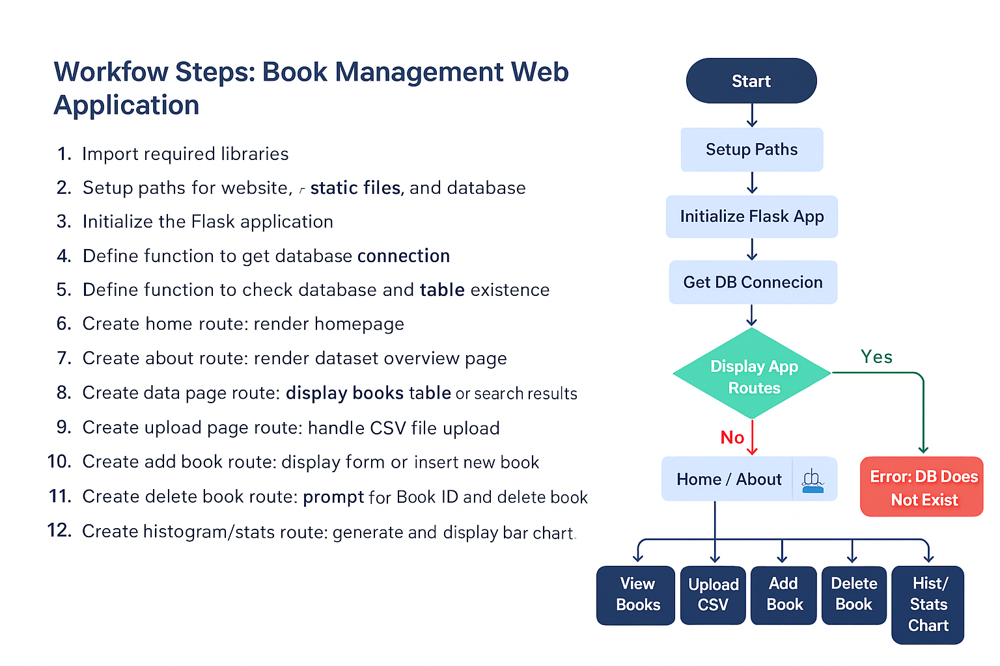

# DAB 111 Intro to Python Programming  Group 13 Project

**Summary**

This project is a Flask-based data application for the **DAB 111 Intro to Python Programming** course. It allows users to upload book datasets, store them in SQLite, manage records (Operation), search data, and generate category-based visualizations. It demonstrates practical skills in Flask, Python, and database management, and is organized into two main components: data preparation and application execution.


This project is organized into two primary components.
---

First Part:
---

The first part of this project focuses on preparing the dataset before loading it into the Flask/SQLite  pplication.
All steps in part  come directly from the data-processing notebook as the follwing:
<a href="https://htmlpreview.github.io/?https://github.com/Adel4itca/DAB111_G13_Project/blob/main/data%20processing/DAB111_Process_Data.html" target="_blank">
    Instruction File
</a>
* 1- Dataset Information
    * About the Dataset
    * Dataset Dictionary
* 2- Data Loading
* 3- Data Cleaning and Preprocessing
    * Drop irrelevant features in our dataset
    * Check and rename/ modify some column names
    * Check for missing values
    * Remove all the rows with missing values If it exists
* 4- Create  new clean CSV file to data collection folder to upload to Data Base


Second Part:
---

The second  part of this project focuses on develop application allows users to upload book datasets, store them in SQLite, search & view records, perform CRUD operations, and generate category-based statistical visualizations


#  **Application Flowchart**

This flowchart explains the full workflow of the Flask application, including file upload, database processing, search, CRUD operations, and statistics generation:



#  **Functional Overview**

### **1. Data Upload Mechanism**

* Upload `.csv` datasets
* Parsed using Pandas
* Stored in SQLite (`books.db`)

### **2. SQLite Data Operations**

* Automatically creates/updates `books` table
* Fast queries and data persistence

### **3. Search & View Data**

Search by:

* Title
* Category
* BookID

Supports partial matching using SQL `LIKE`.

### **4. Applicatin function**

* Add new book entries
* Delete books by BookID
* View full dataset

### **5. Visual Analytics**

* Histogram of book categories
* Created using Matplotlib
* Auto-updates when the database changes


---


# **Repository Structure**

```
DAB111_G13_Project/
├── app.py
|── auto_setup.bat
|── function_app.py
├── README.md
├── requirements.txt
│
├── database/
│   └── books.db
│
├── data_collection/
│   └── (uploaded csv files)
│
├── static/
│   ├── css/
│   │   └── style.css
│   └── images/
│       └── FlowChart.png
│
└── website/
    ├── templates/
    │   ├── base.html
    │   ├── home.html
    │   ├── about.html
    │   ├── data.html
    │   ├── upload.html
    │   ├── add.html
    │   ├── delete.html
    │   └── hist_stats.html
```

---

#  **Installation & Setup Guide**
   **The project can be installed in two ways:**

### Option 1 — Auto Installation (Recommended) 
1. Download the Auto-Setup .BAT File
Click below to download the auto-setup file:
 **[Download auto_setup.bat](https://raw.githubusercontent.com/Adel4itca/DAB111_G13_Project/main/auto_setup.bat)**
(Right-click → “Save link as…” and save to your computer)

2. Run the Installer
Double-click the file:

```bash
auto_setup.bat
```

The automatic installer will:
    Ask you where to install the application
    Ask you for a project folder name
    Automatically download the latest project from GitHub
    Create a virtual environment
    Install all required packages from requirements.txt
    Automatically run app.py

### Option 2 — Install the Project Manually**

```bash
git clone https://github.com/Adel4itca/DAB111_G13_Project.git
Or
Down Load The ZIP file and exctarcted on folder DAB111_G13_Project
cd DAB111_G13_Project
```

### **2. Create Virtual Environment**


```bash
python -m venv venv
```


### **3. Activate Environment**

**Windows**

```bash
venv\Scripts\activate
```

If you found any problems related to venv\Scripts\activate

CategoryInfo          : SecurityError: (:) [], PSSecurityException
FullyQualifiedErrorId : UnauthorizedAccess


```bash
Set-ExecutionPolicy -Scope Process -ExecutionPolicy Bypass
```

### **4. Install Dependencies**

```bash
pip install -r requirements.txt
```

### **5. Run Application**

```bash
python app.py
```

Visit:
[http://127.0.0.1:5000](http://127.0.0.1:5000)

---

#  **Getting Started**

### **Upload Page**

Upload `.csv`  saves to SQLite DB

### **Display Data - Page**

View and search records By BookID or Title OR Category 

### **Add Records - Page**

Add new books
        Validate required fields and Check if BookID already exists
        	
### **Delete Records - Page**

Delete by BookID

### **Display Statistics - Page**

Shows histogram of categories

---

#  **Tools & Technologies**

* Python 3.12+
* Flask
* SQLite
* Pandas
* Matplotlib
* HTML / CSS
* 

---

#  **Team Members – Group 13**

| Name                | Student ID |
| ------------------- | ---------- |
| Adel Hasan          | 0888146    |
| Sumit Singh Gulshan | 0888735    |

---

#  **License**

This project is for educational use within  
**DAB 111 Intro to Python Programming**, St. Clair College.


