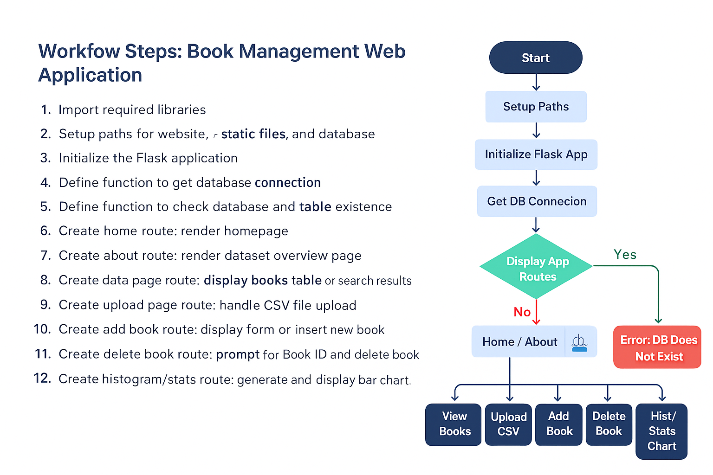

# **DAB111 Group 13 – Flask Data Website Project**


This project is a complete **Flask-based data application** developed for the DAB111 course. It allows users to upload book datasets, store them in SQLite, search & view records, perform CRUD operations, and generate category-based statistical visualizations.

It demonstrates skills in **databases, Flask, Python programming**.


This project is organized into two primary components.
---

First Part:
---

The first part of this project focuses on preparing the dataset before loading it into the Flask application.
All steps in part  come directly from the data-processing notebook as the follwing:
<a href="https://htmlpreview.github.io/?https://github.com/Adel4itca/DAB111_G13_Project/blob/main/data%20processing/DAB111_Process_Data.html" target="_blank">
    Instruction File
</a>

[Instruction File](https://htmlpreview.github.io/?https://github.com/Adel4itca/DAB111_G13_Project/blob/main/data%20processing/DAB111_Process_Data.html)
* 1- Dataset Information
    * About the Dataset
    * Dataset Dictionary
* 2- Data Loading
* 3- Data Cleaning and Preprocessing
    * Drop irrelevant features in our dataset
    * Check and rename/ modify some column names
    * Check for missing values
    * Remove all the rows with missing values If it exists
* 4- Create  new clean CSV file to data collection folder to upload to Data Base

Second Part:
---

The second  part of this project focuses on develop application allows users to upload book datasets, store them in SQLite, search & view records, perform CRUD operations, and generate category-based statistical visualizations


#  **Application Flowchart**

This flowchart explains the full workflow of the Flask application, including file upload, database processing, search, CRUD operations, and statistics generation:



#  **Key Features**

### **1. Upload System**

* Upload `.csv` datasets
* Parsed using Pandas
* Stored in SQLite (`books.db`)

### **2. SQLite Database Integration**

* Automatically creates/updates `books` table
* Fast queries and data persistence

### **3. Search & View Data**

Search by:

* Title
* Category
* BookID

Supports partial matching using SQL `LIKE`.

### **4. CRUD Operations**

* Add new book entries
* Delete books by BookID
* View full dataset

### **5. Visual Analytics**

* Histogram of book categories
* Created using Matplotlib
* Auto-updates when the database changes

### **6. Clean UI**

* Navigation menu
* Success & error messages
* Responsive templates

---


# **Project Structure**

```
DAB111_G13_Project/
├── app.py
├── README.md
├── requirements.txt
│
├── database/
│   └── books.db
│
├── data_collection/
│   └── (uploaded csv files)
│
├── static/
│   ├── css/
│   │   └── style.css
│   └── images/
│       └── FlowChart.png
│
└── website/
    ├── templates/
    │   ├── base.html
    │   ├── home.html
    │   ├── about.html
    │   ├── data.html
    │   ├── upload.html
    │   ├── add.html
    │   ├── delete.html
    │   └── hist_stats.html
```

---

#  **Installation & Setup**

### **1. Clone Repo**

```bash
git clone https://github.com/Adel4itca/DAB111_G13_Project.git
cd DAB111_G13_Project
```

### **2. Create Virtual Environment**

```bash
python -m venv venv
```

### **3. Activate Environment**

**Windows**

```bash
venv\Scripts\activate
```

**Mac/Linux**

```bash
source venv/bin/activate
```

### **4. Install Dependencies**

```bash
pip install -r requirements.txt
```

### **5. Run Application**

```bash
python app.py
```

Visit:
[http://127.0.0.1:5000](http://127.0.0.1:5000)

---

#  **How to Use the App**

### **Upload Page**

Upload `.csv` → saves to SQLite

### **Data Page**

View and search records

### **Add Page**

Add new books

### **Delete Page**

Delete by BookID

### **Statistics Page**

Shows histogram of categories

---

#  **Technologies Used**

* Python 3.12+
* Flask
* SQLite
* Pandas
* Matplotlib
* HTML / CSS
* Jinja2

---

#  **Team Members – Group 13**

| Name                | Student ID |
| ------------------- | ---------- |
| Adel Hasan          | 0888146    |
| Sumit Singh Gulshan | 0888735    |

---

#  **License**

This project is created for educational use in
**DAB111 – Database Fundamentals**, St. Clair College.


